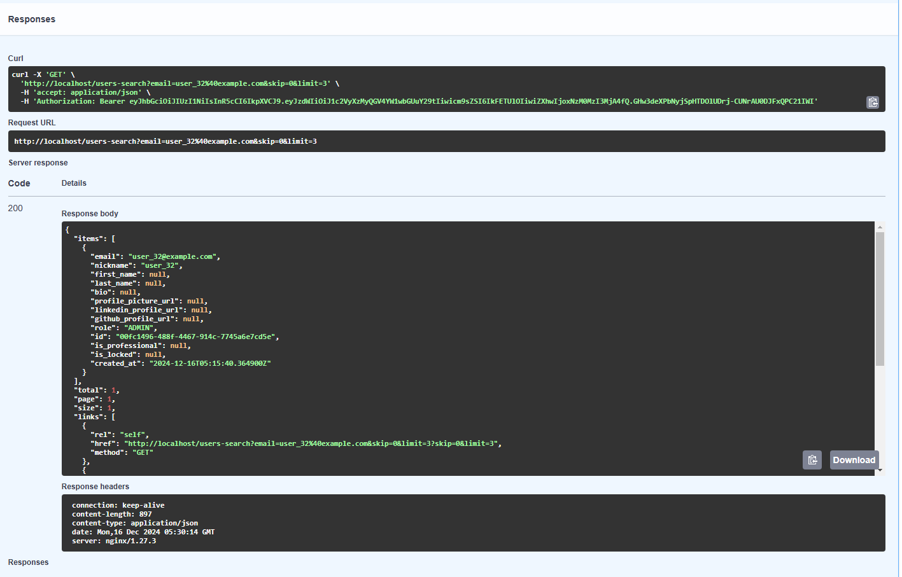

# Final Project : User Management System

User Management System is a FastAPI-based web application that provides administrators the ability to manage user accounts efficiently. The project includes core functionalities like user creation, role-based access control, email verification, and advanced user search and filtering. It adheres to modern software development best practices, including clean code, robust testing, and automated deployment pipelines.

The application is containerized using Docker and successfully deployed to DockerHub. Continuous Integration (CI) and Continuous Deployment (CD) processes were established using GitHub Actions, ensuring a seamless and automated workflow for testing and deployment.

🔗 DockerHub Repository: [mahibala/user_management](https://hub.docker.com/repository/docker/mahibala/user_management/general)

🔗 Github Repository: [mahibala-njit](https://github.com/mahibala-njit/user_management)

## Issues

Here are the links to the 5 QA Issues that were identified and resolved during the project development
1. [Docker Build Issue - Error with libc-bin](https://github.com/mahibala-njit/user_management/issues/1)
2. [Enhance Username Validation](https://github.com/mahibala-njit/user_management/issues/8)
3. [Ignores User-Provided Nicknames During User Creation](https://github.com/mahibala-njit/user_management/issues/11)
4. [Enhance Password Validation](https://github.com/mahibala-njit/user_management/issues/14)
5. [Issue with Login endpoint and Swagger Authorize](https://github.com/mahibala-njit/user_management/issues/17)

## Test Coverage Improvement

Test coverage was around 81% for the project to begin with. Added tests to cover edge cases for various scenarios.
Current Test coverage is 91% with 222 tests. Overall, more than 100 tests were added.

### Links to additional tests

**Additional Tests to existing files**:
- [Additional Tests for User Service](https://github.com/mahibala-njit/user_management/blob/main/tests/test_services/test_user_service.py#L171-L503)
- [Additional Tests for User API](https://github.com/mahibala-njit/user_management/blob/04b86fa12e6f7adba8deb50e67a89da1f6126d8e/tests/test_api/test_users_api.py#L194-L271)

**Added the below new test files to cover addtional tests**:
- [Testing User Routes](https://github.com/mahibala-njit/user_management/blob/main/tests/test_api/test_user_routes.py)
- [Testing Dependencies](https://github.com/mahibala-njit/user_management/blob/main/tests/test_dependencies.py)
- [Testing Email Service](https://github.com/mahibala-njit/user_management/blob/main/tests/test_services/test_email_service.py)
- [Tests for the User Search feature](https://github.com/mahibala-njit/user_management/blob/main/tests/test_user_search.py)

## New Feature : User Search and Filtering

**Description**: Administrators can search for users based on username, email, role, account status, and registration date. This feature simplifies user management and enhances the user experience.

**Related Main Commit**: 
[Commit](https://github.com/kaw393939/user_management/commit/0ba9317fb00759b4d6fa220bb4690f537035467c)

**Swagger End points**:

**Implementation Details**:
- Added search functionality with filters for:
    - Username: Partial match using SQL ilike.
    - Email: Partial match using SQL ilike.
    - Role: Exact match on user role (e.g., ADMIN, MANAGER).
    - Account Lock Status: Filter locked or unlocked accounts.
    - Date Ranges: Filter users based on registration dates.
- Implemented pagination to handle large datasets efficiently.

### Basic Search Endpoint

**Route**: GET /users-search

**Tags**: User Search Requires (Admin Role)

**Purpose**:
This endpoint provides basic search functionality for administrators to search and filter users based on criteria like username, email, role, and account lock status.

**Key Features**:
- Supports query parameters to specify filters (e.g., username, email, role, is_locked).
- Implements pagination to limit the size of results and improve performance.
- Returns a paginated list of users that match the provided search criteria.
- Includes pagination links for navigating through the results.
- Filters are echoed back in the response for better client-side usability.

**How It Works**:
- The UserSearchQueryRequest schema is used to parse and validate query parameters.
- The UserService.search_and_filter_users method performs the database query with the specified filters and returns:
        - Total number of matching users.
        - A list of user records for the current page.
- The response includes:
        - User details (serialized using UserResponse).
        - Pagination links for next, previous, and self pages.
        - Filters applied during the search.

**Example Use Case**: "As an administrator, I want to quickly find users with locked accounts or search by username to perform account management tasks."
Wrote unit tests and integration tests to verify functionality.

**Swagger Test Example**:
1. Search by Username:

2. Search by Email:

3. Search by Role:

4. Search by Status:

### Advanced Search Endpoint

**Route**: POST /users-advanced-search

**Tags**: User Search Requires (Admin Role)

**Purpose**:
This endpoint provides advanced search functionality for administrators to perform more flexible and powerful searches using a JSON body containing multiple criteria.

**Key Features**:
- Accepts complex search filters in the request body using the UserSearchFilterRequest schema.
- Allows for advanced filtering options, including:
        - Username and email patterns.
        - User roles (e.g., ADMIN, MANAGER, ANONYMOUS).
        - Account lock status.
        - Date ranges for user creation (created_from, created_to).
- Implements pagination with skip and limit parameters for efficient result handling.
- Returns a paginated list of users matching the advanced search criteria.
- Includes pagination links and filters in the response.

**How It Works**:
- The filters parameter (JSON body) allows administrators to specify multiple filter conditions.
- The UserService.advanced_search_users method dynamically applies the provided filters to the database query.
- The response includes:
        - User details (serialized using UserResponse).
        - Pagination links for seamless navigation.
        - Applied filters for client-side reference.

**Example Use Case**: "As an administrator, I want to find all users created in the last month with the role MANAGER and filter out locked accounts for detailed reporting."

**Swagger Test Example**:

1. Search by Status:

2. Filter by Registration Date (Created Date):

### Comparison

The following table provides a clear comparison of the two endpoints for **user search and filtering**, designed to help administrators manage users effectively.

| **Endpoint**                 | **Method** | **Input**              | **Search Criteria**                   | **Purpose**                                   |
|------------------------------|------------|------------------------|---------------------------------------|----------------------------------------------|
| `/users-search`              | `GET`      | Query Parameters       | Username, email, role, lock status    | Simple and quick searches for users.         |
| `/users-advanced-search`     | `POST`     | JSON Body              | Username, email, role, lock status, date range | Advanced and flexible user filtering.        |

---

## GitHub Actions

- Successful Latest Github action Run: https://github.com/mahibala-njit/user_management/actions/runs/12381016541
- Environment Variables: Sensitive configurations are securely managed using GitHub Secrets.

## DockerHub Deployment

The project has been successfully deployed to DockerHub. Access the Docker image using the following link:

    🔗 DockerHub Repository: https://hub.docker.com/repository/docker/mahibala/user_management/general

    🔗 Docker Image: https://hub.docker.com/repository/docker/mahibala/user_management/tags/3a9c3f598b80294b9ae6b413d1f670f2e46153d1/sha256-e81fe373b956b12cb63e9b3bf2e6054bf9d9cbfe180a9d8094fcb73931e4ab30

The deployment process was automated using GitHub Actions, ensuring that every commit and pull request triggers automated builds and tests before deployment.

## Commit History
Maintained a consistent and structured development process, with well-documented commits exceeding the required minimum of 10 commits. Each commit reflects incremental progress, addressing specific issues, tests, or feature enhancements.

# Course and Project Reflection

The IS601 Web Systems Development course has been a challenging yet deeply rewarding experience that provided me with critical technical and problem-solving skills essential for modern software development. This course covered advanced programming, industry-standard practices, and the mindset needed to succeed in real-world projects.

## Key Takeaways

1. **Python Programming and FastAPI**
I gained proficiency in Python for server-side development, specifically with the FastAPI framework. Learning how to design RESTful APIs, manage request-response flows, and validate data using Pydantic was critical.

2. **Clean Code and Design Patterns**
Through assignments and projects, I implemented design patterns such as:

- Command Pattern: Streamlined calculator operations by encapsulating logic into reusable commands.
- Plugin Pattern: Dynamically loaded calculator functionalities for scalability.
- Facade Pattern: Simplified complex processes (e.g., history management).
- Singleton Pattern: Managed centralized, efficient history storage in applications.

3. **DevOps and CI/CD**
Setting up GitHub Actions for automated testing and integration was a major milestone. I understood how to configure continuous integration pipelines to test code reliability upon every commit. The use of Docker for containerization enabled seamless deployment, ensuring that the application worked consistently across environments.

4. **Database Management with SQLAlchemy**
I learned to implement Object Relational Mapping (ORM) using SQLAlchemy, managing both synchronous and asynchronous database interactions. This skill was reinforced while building advanced query systems for user management.

5. **Testing and Debugging**
Writing unit tests using Pytest and addressing edge cases taught me the importance of robust testing. Mocking external dependencies, managing coverage, and logging provided deeper insights into debugging workflows.

6. **Professional Development Practices**

This course emphasized:

- Using GitHub effectively for version control and collaboration.
- Following clean coding standards with Pylint and ensuring comprehensive test coverage.
- Managing configurations dynamically through .env files for various environments (development, production).

## Final Project Reflection

The final project **User Management - User Search and Filtering**, provided an opportunity to integrate all the concepts and skills learned throughout the course into a robust and functional feature. This project aimed to empower administrators with the ability to efficiently manage users through search and filtering capabilities. By implementing two endpoints – Basic Search and Advanced Search – I ensured a flexible and scalable solution that could handle complex queries, including filtering by username, email, role, account status, and registration date ranges. The inclusion of pagination and structured responses further improved performance and usability, making the API well-suited for large datasets.

Technically, the project challenged me to work with asynchronous database queries using SQLAlchemy, Mocking external dependencies, such as the email service, ensured smooth testing in both local and CI/CD environments. I also implemented GitHub Actions for automated testing, guaranteeing reliability and quality at every step.

# Conclusion

This course has been a significant stepping stone in my career journey and helped me develop the understanding for the below

- Technical proficiency in building scalable web applications with Python and FastAPI.
- A good understanding of design patterns, testing strategies, continuous integration and deployment processes.
- The ability to manage complex projects using version control, clean coding practices, and modern tools like Docker and GitHub Actions.

The midterm and final projects served as perfect platforms to apply these learnings. They not only tested my technical skills but also reinforced the importance of planning, debugging, and adhering to professional standards.

I feel more confident in tackling real-world development challenges and contributing to industry-grade applications. The course has equipped me with the mindset and tools to thrive in a competitive environment.
