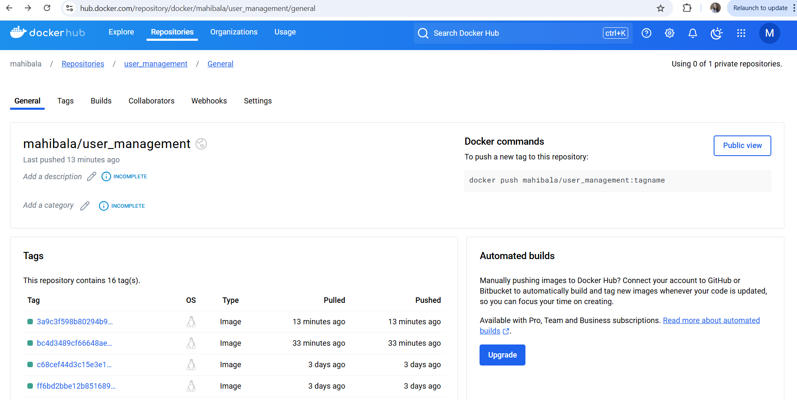

# The User Management System Final Project

The User Management System is a FastAPI-based web application that provides administrators the ability to manage user accounts efficiently. The project includes core functionalities like user creation, role-based access control, email verification, and advanced user search and filtering. It adheres to modern software development best practices, including clean code, robust testing, and automated deployment pipelines.

The application is containerized using Docker and successfully deployed to DockerHub. Continuous Integration (CI) and Continuous Deployment (CD) processes were established using GitHub Actions, ensuring a seamless and automated workflow for testing and deployment.

🔗 DockerHub Repository: https://hub.docker.com/repository/docker/mahibala/user_management/general
🔗 Github Repository: https://github.com/mahibala-njit/user_management

## Issues
Here are the links to the 5 QA Issues that were identified and resolved during the project development
1. [Docker Build Issue - Error with libc-bin](https://github.com/mahibala-njit/user_management/issues/1)
2. [Enhance Username Validation](https://github.com/mahibala-njit/user_management/issues/8)
3. [Ignores User-Provided Nicknames During User Creation](https://github.com/mahibala-njit/user_management/issues/11)
4. [Enhance Password Validation](https://github.com/mahibala-njit/user_management/issues/14)
5. [Issue with Login endpoint and Swagger Authorize](https://github.com/mahibala-njit/user_management/issues/17)

## Test Coverage Improvement
Test coverage was around 81% for the project to begin with. Added tests to cover edge cases for various scenarios.
Current Test coverage is 91% with 222 tests. Overall, more than 100 tests were added.

### Links to additional tests

**Additional Tests to existing files**:
- [Additional Tests for User Service](https://github.com/mahibala-njit/user_management/blob/main/tests/test_services/test_user_service.py#L171-L503)
- [Additional Tests for User API](https://github.com/mahibala-njit/user_management/blob/04b86fa12e6f7adba8deb50e67a89da1f6126d8e/tests/test_api/test_users_api.py#L194-L271)

**Added the below new test files to cover addtional tests**:
- [Testing User Routes](https://github.com/mahibala-njit/user_management/blob/main/tests/test_api/test_user_routes.py)
- [Testing Dependencies](https://github.com/mahibala-njit/user_management/blob/main/tests/test_dependencies.py)
- [Testing Email Service](https://github.com/mahibala-njit/user_management/blob/main/tests/test_services/test_email_service.py)
- [Tests for the User Search feature](https://github.com/mahibala-njit/user_management/blob/main/tests/test_user_search.py)

## New Feature : User Search and Filtering
**Description**: Administrators can search for users based on username, email, role, account status, and registration date. This feature simplifies user management and enhances the user experience.
**Related Main Commit**: 
[Commit](https://github.com/kaw393939/user_management/commit/0ba9317fb00759b4d6fa220bb4690f537035467c)
**Implementation Details**:
- Added search functionality with filters for:
    - Username: Partial match using SQL ilike.
    - Email: Partial match using SQL ilike.
    - Role: Exact match on user role (e.g., ADMIN, MANAGER).
    - Account Lock Status: Filter locked or unlocked accounts.
    - Date Ranges: Filter users based on registration dates.
- Implemented pagination to handle large datasets efficiently.

### Basic Search Endpoint
**Route**: GET /users-search
**Tags**: User Search Requires (Admin Role)
**Purpose**:
This endpoint provides basic search functionality for administrators to search and filter users based on criteria like username, email, role, and account lock status.
**Key Features**:
- Supports query parameters to specify filters (e.g., username, email, role, is_locked).
- Implements pagination to limit the size of results and improve performance.
- Returns a paginated list of users that match the provided search criteria.
- Includes pagination links for navigating through the results.
- Filters are echoed back in the response for better client-side usability.
**How It Works**:
- The UserSearchQueryRequest schema is used to parse and validate query parameters.
- The UserService.search_and_filter_users method performs the database query with the specified filters and returns:
        - Total number of matching users.
        - A list of user records for the current page.
- The response includes:
        - User details (serialized using UserResponse).
        - Pagination links for next, previous, and self pages.
        - Filters applied during the search.
**Example Use Case**: "As an administrator, I want to quickly find users with locked accounts or search by username to perform account management tasks."
Wrote unit tests and integration tests to verify functionality.
**Swagger Test Example**:
1. Search by Email:

2. Search by Role:

## GitHub Actions
- Successful Latest Github action Run: https://github.com/mahibala-njit/user_management/actions/runs/12381016541
- Mocking SMTP Emails: During GitHub Actions runs, email services are mocked to prevent real emails from being sent.
- Environment Variables: Sensitive configurations are securely managed using GitHub Secrets.

## DockerHub Deployment
The project has been successfully deployed to DockerHub. Access the Docker image using the following link:
🔗 DockerHub Repository: https://hub.docker.com/repository/docker/mahibala/user_management/general
🔗 Docker Image: https://hub.docker.com/repository/docker/mahibala/user_management/tags/3a9c3f598b80294b9ae6b413d1f670f2e46153d1/sha256-e81fe373b956b12cb63e9b3bf2e6054bf9d9cbfe180a9d8094fcb73931e4ab30

The deployment process was automated using GitHub Actions, ensuring that every commit and pull request triggers automated builds and tests before deployment.

## Commit History
Maintained a consistent and structured development process, with well-documented commits exceeding the required minimum of 10 commits. Each commit reflects incremental progress, addressing specific issues, tests, or feature enhancements.

# Course and Project Reflection

## Key Learnings

CI/CD Integration: Implementing automated pipelines significantly improved development efficiency.
Testing Best Practices: Writing both unit tests and integration tests helped achieve high test coverage and robust code.
Environment Management: Learned to separate and securely manage configurations for local, development, and production environments.
Advanced Querying: Improved proficiency with SQLAlchemy by implementing dynamic queries for search and filtering.

## Challenges Faced
SMTP Configuration: Configuring SMTP for both local and CI/CD environments required careful handling of secrets and mocking email services in tests.
Test Isolation: Ensuring test databases were cleaned up after each run using Alembic migrations and scoped sessions.
Role Management: Auto-assigning roles while maintaining constraints (e.g., only one ADMIN on initialization).
Deployment Automation: Setting up reliable GitHub Actions pipelines for CI/CD was time-intensive but rewarding.

# Conclusion
This project was a valuable opportunity to apply modern software development practices, including clean architecture, automated testing, and deployment pipelines. The User Search and Filtering feature showcases the power of dynamic queries and thoughtful API design to address real-world administrative needs.One 

The combination of technical expertise, problem-solving, and professional workflows ensures this project is production-ready and scalable